# Active-Directory-SOC-Home-Lab
## Overview
This project simulates a brute-force attack against a Windows domain environment and demonstrates how it can be detected using a Security Information and Event Management (SIEM) tool.  

## Environment/Technology
-VMware Workstation Pro

-pfSense (firewall)

-Windows Server 2025 (Active Directory)

-Windows 10 (Client)

-Ubuntu (Wazuh SIEM)

-Kali Linux (Hydra)

## Lab Architecture

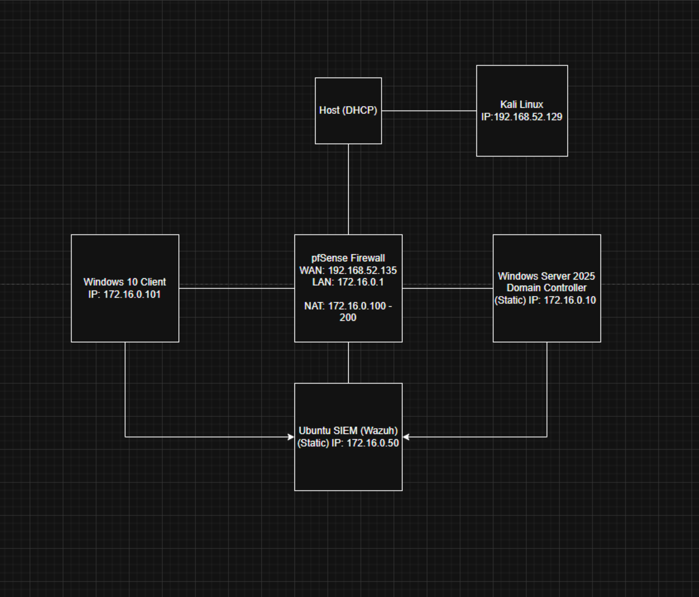

## Attack Scenario: RDP Brute-Force
I configured the client machine to allow RDP services and setup a port forwarding rule on the firewall to allow and forward RDP traffic on port 3389, purely for the demonstration in this lab. 

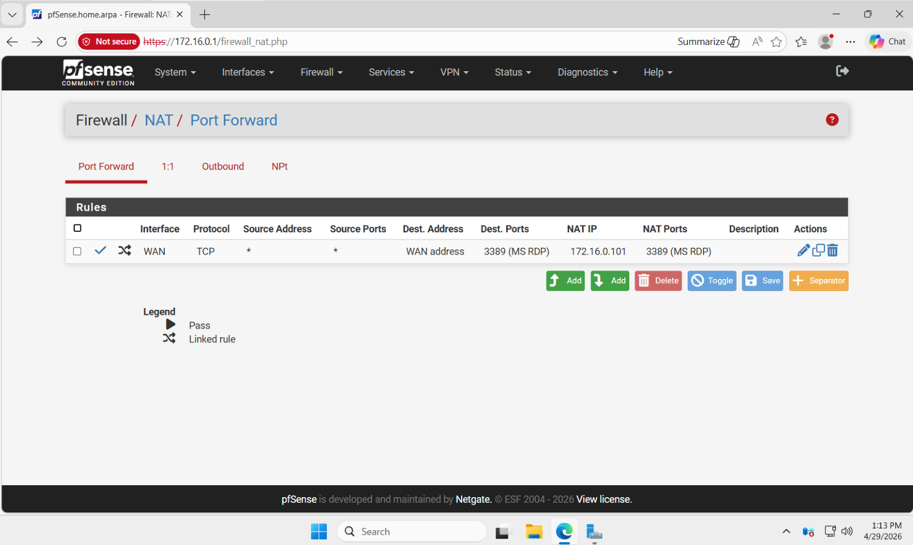

After scanning the target WAN IP with nmap, a brute-force attack was launched from the Kali machine against the domain-joined Windows client.

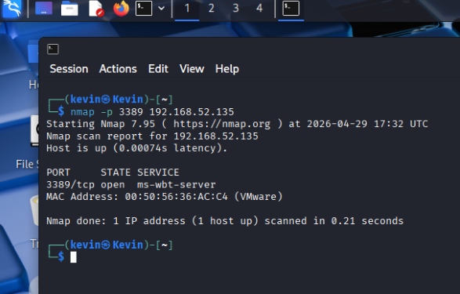

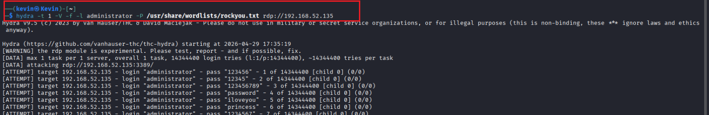

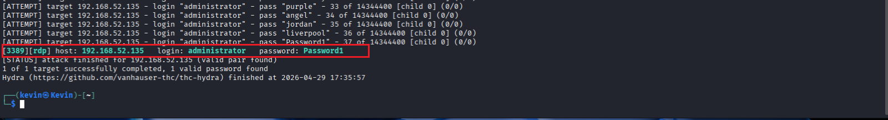

Using xfreerdp3 to remote into the domain-joined client, I added a backdoor account to maintain persistence and assigned it to the administrators group to escalate my privileges

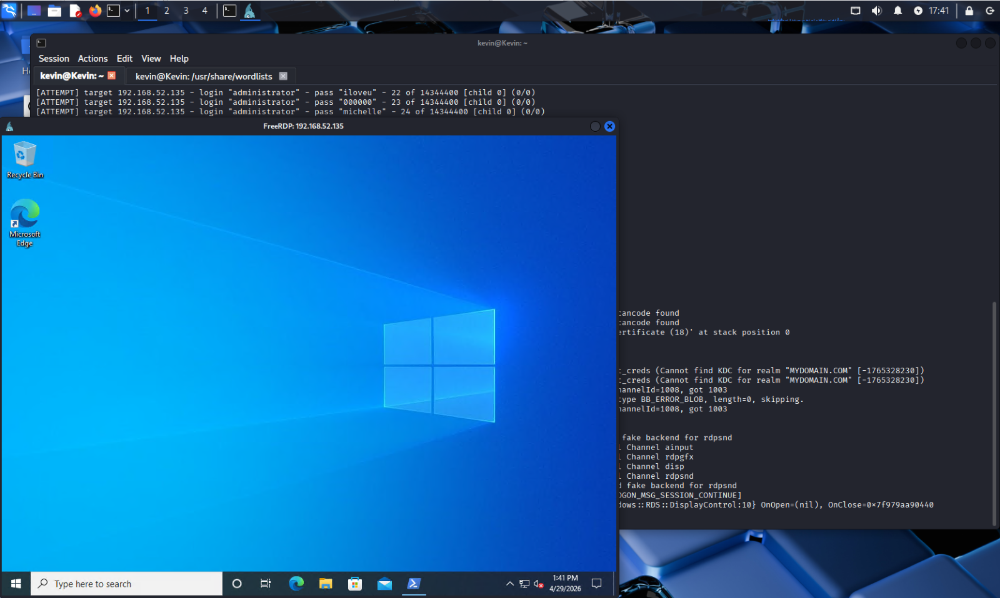

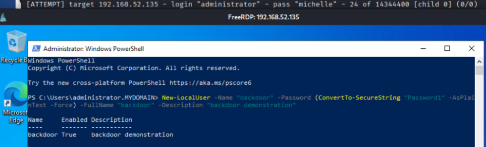

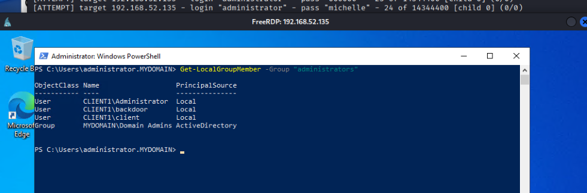

**Outcome:**

-Multiple failed login attempts using the pre-configured wordlist "rockyou.txt" containing weak passwords

-Hydra successfully identified valid credentials

-Remote access to the target system was achieved via RDP

-A "backdoor" account with elevated privileges was added to maintain persistence 

## Detection and Monitoring with Wazuh

I installed Wazuh agents on both the domain controller and the client machine to forward event logs to the SIEM server. For this attack, I focused on two Windows event IDs related to authentication: 

-4625 (Failed login attempt)

-4624 (Successful login attempt)

The brute-force attack was identified by analyzing repeated failed login attempts followed by a successful login

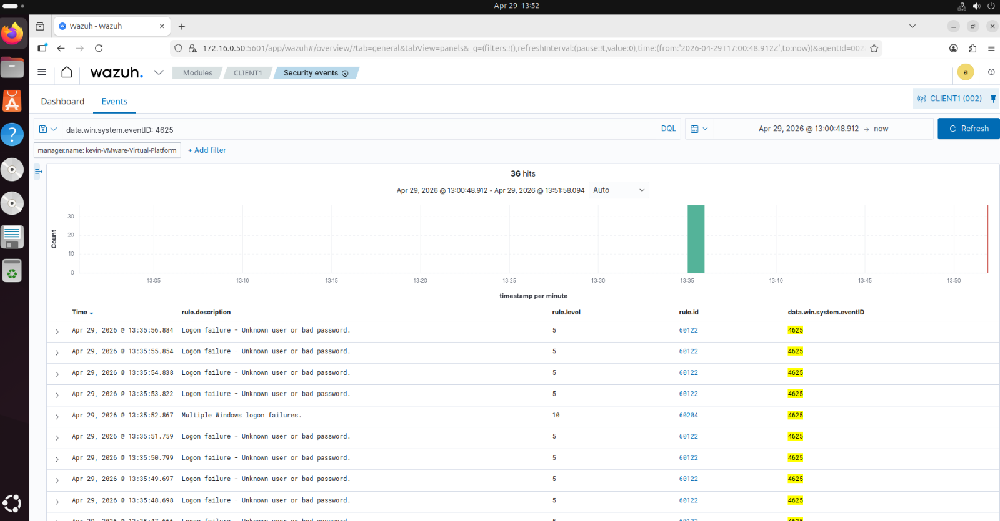

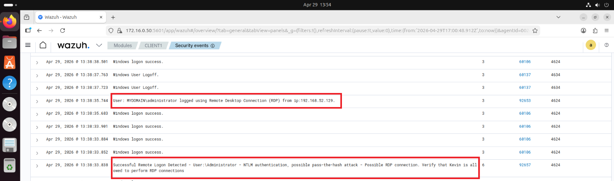

After the successful login, logs were generated for a user account created and for a change to the administators group, signaling the attacker created a backdoor account with admin privileges after the initial compromise

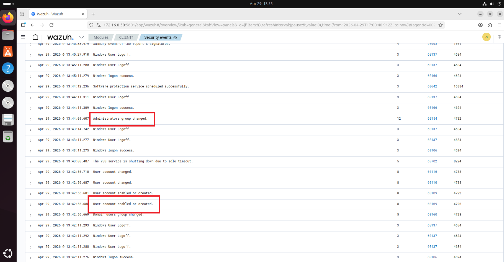

**Detection Walkthrough:**

During the attack, multiple Windows Event ID 4625 logs were generated.

Indicators observed:

-Repeated failed login attempts

-Same username targeted

-Same source IP

This behavior indicates a brute-force attack. Wazuh correlated these events and triggered alerts based on failed authentication thresholds.

**Analyst Perspective:**

If this alert appeared in a SOC, I would:

1. Validate source IP
2. Check volume of failed logins
3. Identify targeted account
4. Confirm successful login (Event ID 4624)
5. Escalate as potential credential compromise

## Firewall Configuration

To harden the firewall after the attack, I first deleted the port forwarding rule on port 3389 to remove RDP access entirely. Then, I added a rule to block all incoming traffic from the attacker's IP address (192.168.52.129)

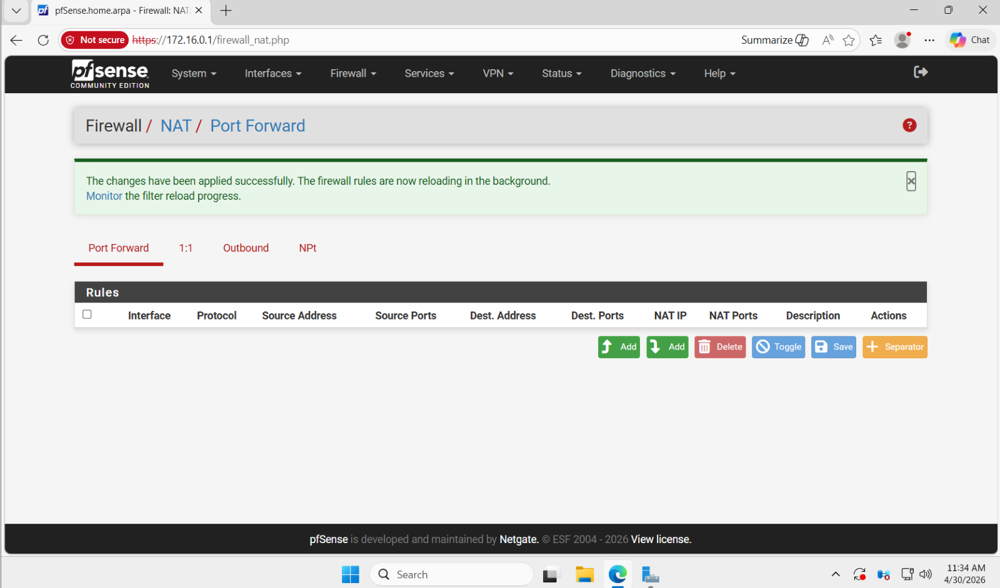

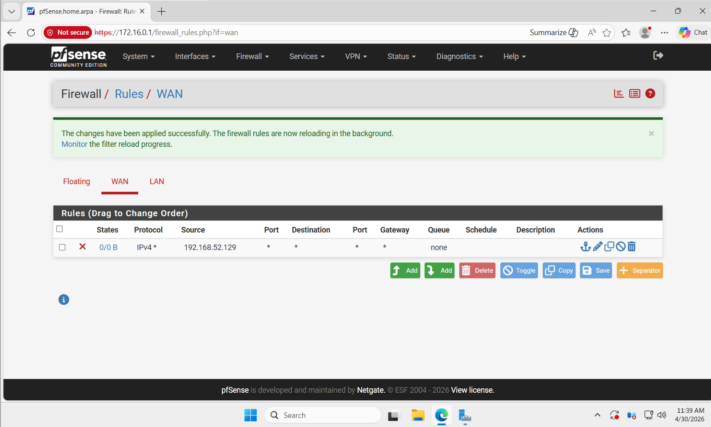

## Group Policy Account Lockout

To protect against password stuffing, I added a group policy object (gpo) in my domain through active directory, setting the threshold to 5 invalid logon attempts before the account locked out (for 10 minutes), and the counter resets every 10 minutes. Down below is a user account in the domain (mbailey) that has been locked out after 5 repeated attempts. To unlock the account immediately as an administrator, I could go to active directory users and groups on the domain controller, find the account in my domain, and unlock it manually. 

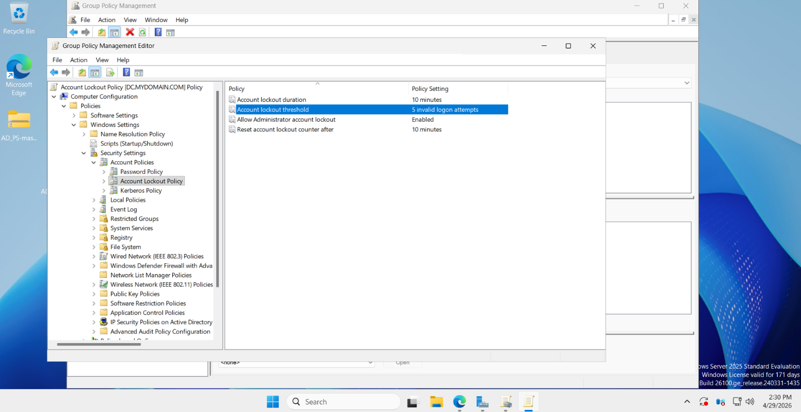

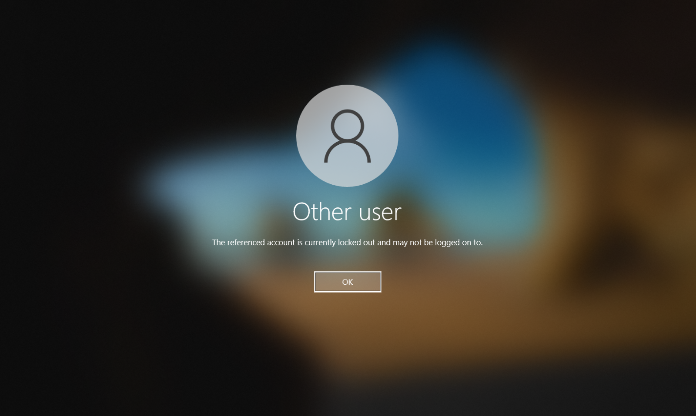

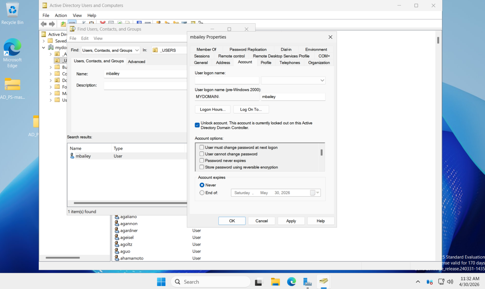

**The Local Administrator Account:**

Since i performed the brute-force attack on the client's local administrator account, its important to note that the GPO from above will not apply to the local admin account. I was having trouble figuring out how to edit the local users and group policy settings, as the domain controllers GPO overrides (and locks) the local settings. Instead, there are better ways to protect the local admin account:

-Instead of lockout, deny access to the administrator account from the network

-Rename/diasbale the built-in administrator account

-Use Microsoft Local Administrator Password Solution (LAPS) to get a unique random local admin password that is stored securely in Active Directory

## Challenges and Lessons Learned

-Firewall rules/configuration impacted RDP connectivity and visibility during testing

-Brute-force detection requires tuning to reduce false positives

-SIEM effectiveness depends heavily on log quality (not quantity) and coverge

## Future Improvements

-Compare SIEM detection results before and after implementing account lockout policies

-Use another SIEM tool (Splunk or Elastic) for comparision

-Automate alerting and response workflows

-Perform a password spraying attack and compare the logs to the password stuffing attack
